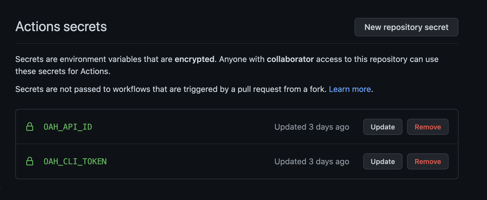

# OpenAPIHub CICD Deployment

---

This action is to upload swagger and readme files to OpenAPIHub

## Inputs

| Name              | Required | Default | Description                                                                                       |
|-------------------|:--------:|---------|---------------------------------------------------------------------------------------------------|
| OAH_CLI_TOKEN     |    [x]   |         | OAH CLI Token.                           |
| README_LOC        |    [ ]   | './openapihub/readme.md'    | Readme file location in Repository             |
| SWAGGER_LOC       |    [ ]   | './openapihub/swagger.json'    | Swagger file location in Repository                                                           |
| OAH_API_ID        |    [x]   |       | API ID (UUID) in OpenAPIHub                                 |

### Secret Config

Please Create Action Secret and store `OAH_CLI_TOKEN` and `OAH_API_ID` instead of putting the value in workflow file.



### Github Actions

* This is a complete `.github/workflow/sync.yml` example.

Set the `now-project-id` and `now-org-id` you found above.

```yaml
name: Sync file

on:
  push:
    branches:
      - master

jobs:
  test:
    runs-on: ubuntu-latest
    steps:
      - uses: actions/checkout@v2
      - uses: flamyitcat/github-api-sync@v1.0.0
        with:
          OAH_CLI_TOKEN: ${{secrets.OAH_CLI_TOKEN}}
          OAH_API_ID: ${{secrets.OAH_API_ID}}
          README_LOC: ''
          SWAGGER_LOC: ''
```
